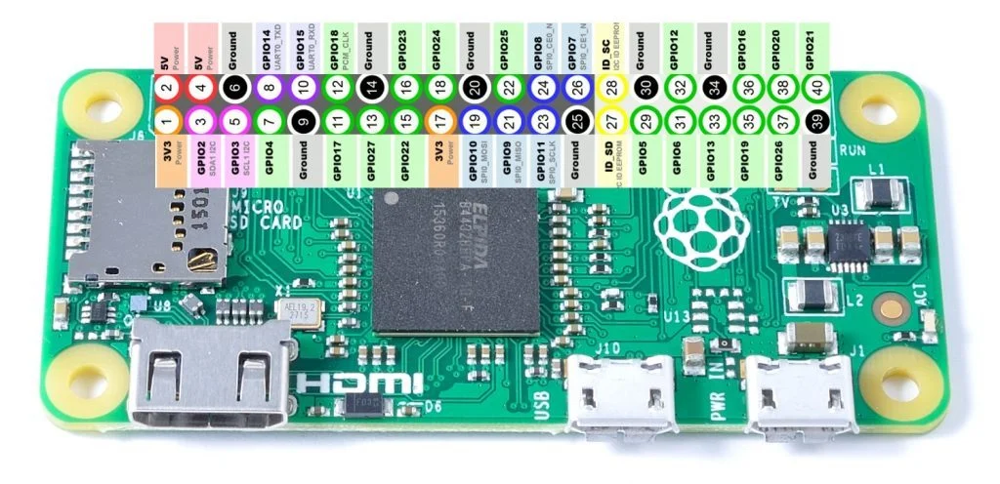

# Human in the Loop 16b

## Raspberry Pi Pins



https://subscription.packtpub.com/book/iot_and_hardware/9781788290524/1/ch01lvl1sec03/raspberry-pi-zero-w

## SSH Port Forwarding

```
ssh -L 8765:172.20.10.11:8765 pi@172.20.10.11
```

ssh -L 8765:172.20.10.12:8765 pi@172.20.10.12

## Helpful Links

- https://toptechboy.com/raspberry-pi-lesson-27-analog-voltages-using-gpio-pwm-in-python/
- https://toptechboy.com/raspberry-pi-lesson-28-controlling-a-servo-on-raspberry-pi-with-python/
- https://docs.quanser.com/quarc/documentation/raspberry_pi_0.html
- https://www.ics.com/blog/control-raspberry-pi-gpio-pins-python
